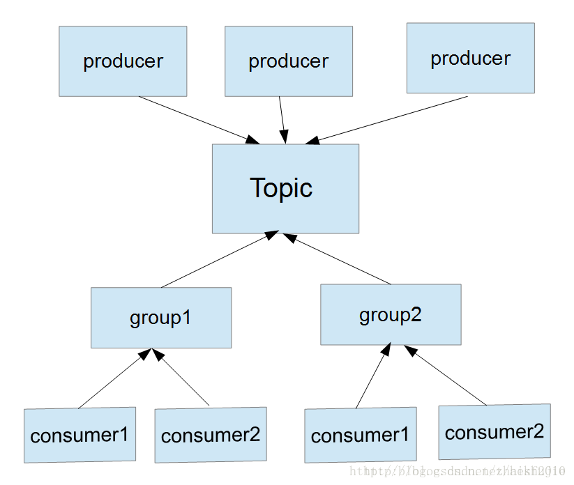

- TOPIC GROUP.ID OFFSET

卡夫卡的broker是无状态的，所以consumer需要记录(topic,partition,group.id)维度下消息消费的偏移量--即offset,如果一个topic被多个group.id订阅，那么他们的offset也是分别维护的。

(topic,parition,group.id)维度下的offset信息存储在zookeeper中。可以手动修改offset，从而重新消费一些消息。

- PARTITION

partition 是topic之下的一个消息存储概念，一个topic的消息可以分散存储到多个parition下，同一个partition下的消息是有序的，partition间不保证顺序。

引入parition是可以提高消息消费的并行度，从而提高消息消费的吞吐量。

